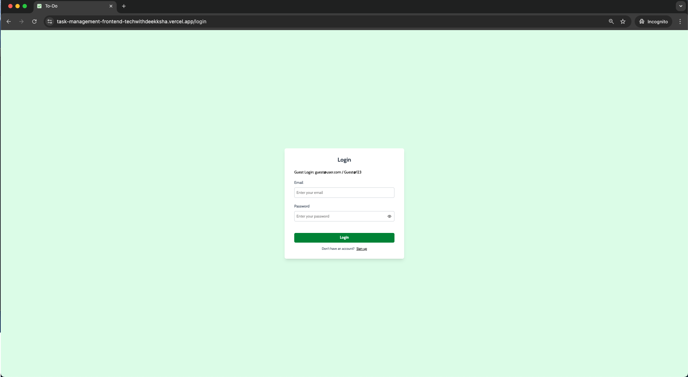
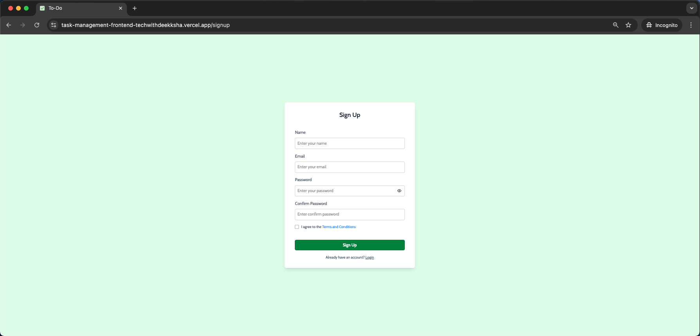
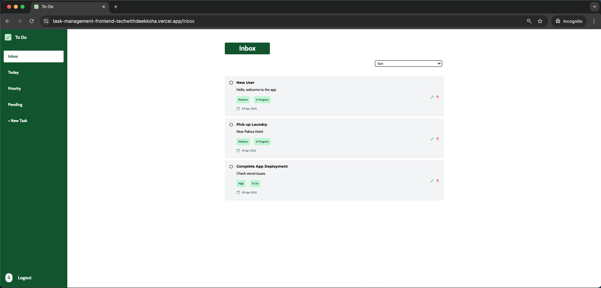
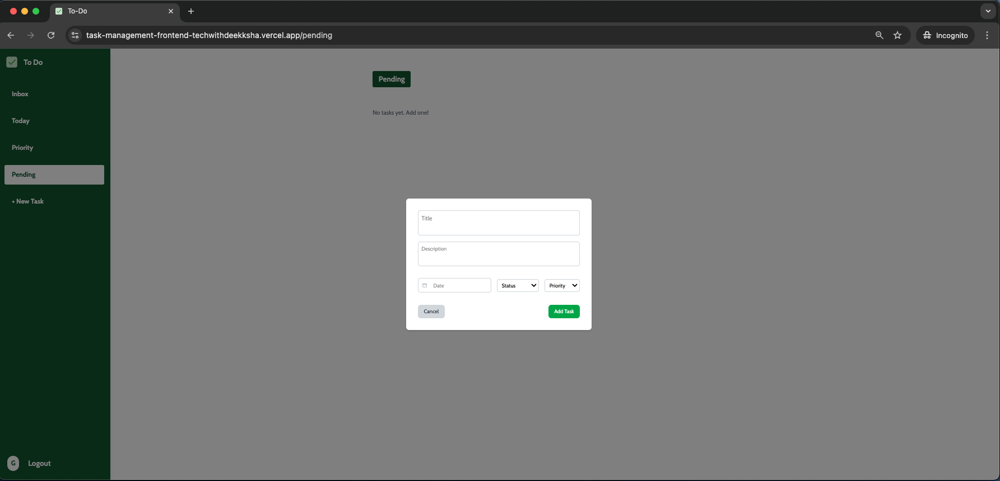
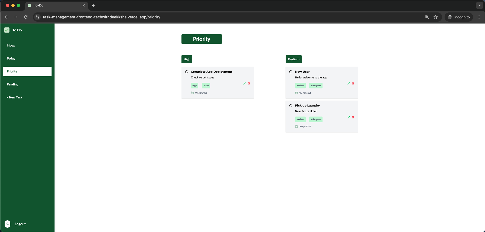
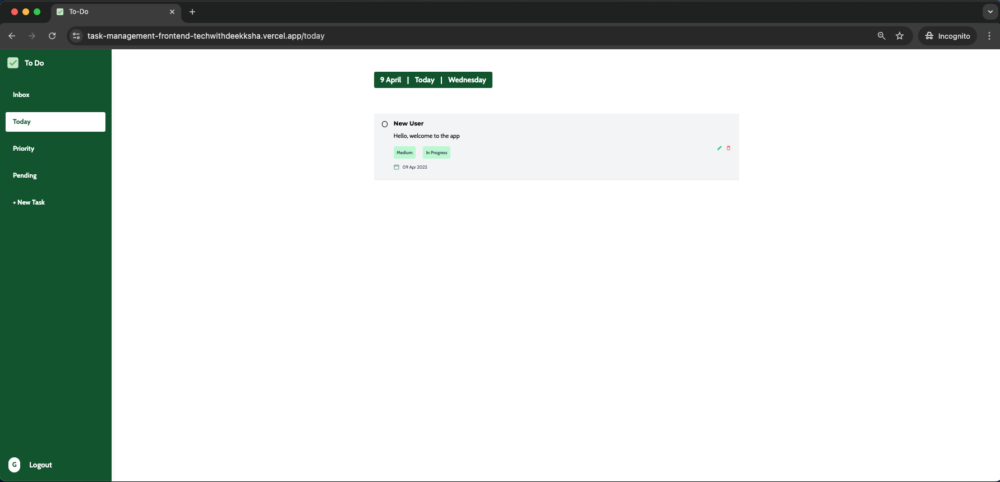

# 📝 Todo App Frontend

Welcome to the **Todo App** — a sleek and responsive task management interface built using **React + Vite**, styled with **TailwindCSS**, and powered by a secure **JWT-authenticated Node.js/Express backend**.

Deployed and ready to help you conquer your daily goals.

<br />

## 🔗 Live Demo

Frontend: [https://task-management-frontend-techwithdeekksha.vercel.app](https://task-management-frontend-techwithdeekksha.vercel.app)  
Backend: [https://task-management-backend-techwithdeekksha.vercel.app](https://task-management-backend-techwithdeekksha.vercel.app)

<br />

## 🚀 Tech Stack

- ⚛️ React + Vite
- 🎨 TailwindCSS
- 🛠️ Redux Toolkit
- 🔐 JWT Authentication
- 🧠 Node.js + Express (Backend)
- 🌐 Vercel (Deployment)

<br />

## ✨ Features

- 🔐 **User Authentication** (Signup / Login with JWT)
- ✅ **Add, Edit, Delete Tasks**
- 📆 **Sort Tasks by Date, Priority, and Progress**
- 📂 **Task Views**: Inbox, Today, Pending, Priority
- 🎯 Fully responsive and mobile-friendly UI
- 🔄 Seamless frontend-backend integration

<br />

## 📸 Screenshots

| Login                           | Signup                            |
| ------------------------------- | --------------------------------- |
|  |  |

| Inbox                           | New Task                                   |
| ------------------------------- | ------------------------------------------ |
|  |  |

| Priority                              | Today                           | Pending |
| ------------------------------------- | ------------------------------- | ------- |
|  |  |

<br />

## 🧪 Installation

Clone the repository:

```bash
git clone https://github.com/Deek1995/todo-app-frontend.git
cd todo-app-frontend
```
